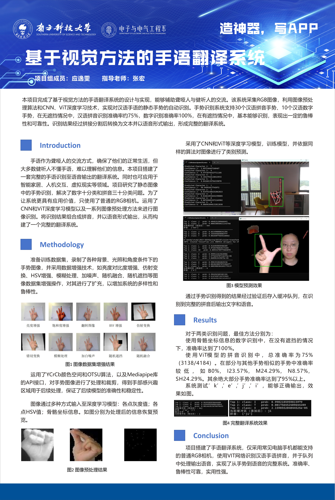

# Sign-Language-Translation-System-Based-on-Visual-Approach
My first Researching Project, Sign Language Translation System Based on Visual Approach, won the Outstanding Program of the Department of Electronics

This project accomplishes the design and implementation of a sign language interpreting system based on visual methods, which can assist the communication between deaf and hearing people. The system collects RGB images and utilizes image preprocessing algorithms and CNN and ViT deep learning techniques to achieve automatic recognition of static gestures in Chinese sign language. The gesture recognition system supports 30 Hanyu Pinyin gestures and 10 Chinese numeric gestures. In the case of no occlusion, the accuracy of Hanyu Pinyin recognition is about 75%, the accuracy of numeric recognition is 100%, and in the case of occlusion, it is basically able to recognize, which shows a certain degree of robustness and reliability. The recognition results are converted to text and output in the form of speech after splicing and segmentation to form a complete translation system.

